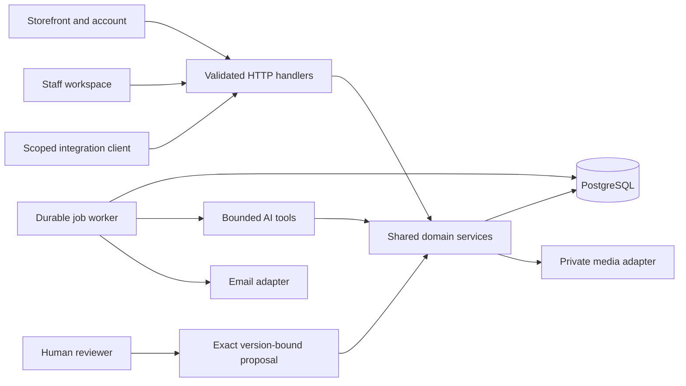

# Architecture

The application is a modular monolith. One PostgreSQL database is the source of truth, one web process serves the store and administration API, and a separate worker consumes durable jobs. This avoids distributed inventory transactions while leaving provider adapters and background work separable as the business grows.

## Boundaries and invariants

- Route handlers establish the actor and validate transport data. Domain services enforce operation scopes even when called outside HTTP.
- Browser sessions and bearer integrations are separate identities. API keys cannot approve proposals or manage staff. AI tool execution rechecks the initiating user's current permissions for every tool.
- Public product DTOs exclude costs, reservations and private media. Price visibility in staff screens is separately scoped. Customer orders require a session owner or a high-entropy guest token; knowing the reference is insufficient.
- Product publication, edits, SKU changes, prices, stock changes, cancellation, fulfilment, payment recording, refund requests and return receipt use exact proposals. A proposal expires after 15 minutes and is bound to the target version. Approval checks the current state again and consumes the proposal transactionally with its audit record.
- Homepage content uses validated section settings and server-sanitized HTML, with a shared renderer for storefront and script-free isolated previews. Media references are transactionally maintained; assets become public only through a visible, active section. Editor versions prevent lost updates. HTML cannot execute application code or create forms.
- Checkout locks SKUs in a consistent order, recalculates the cart, checks stock, creates immutable item snapshots and reserves quantities in one transaction. Idempotency binds the key to the cart actor, operation and canonical payload. Replays return the original result; mismatched payloads conflict.
- Fulfilment decreases both physical and reserved stock. Unpaid, unfulfilled orders expire after 24 hours; maintenance releases reservations once. Cancellation cannot silently unwind shipped stock. A return must be approved and explicitly received as damaged or restockable; refunds remain a separate financial operation.
- Job claims use PostgreSQL `FOR UPDATE SKIP LOCKED`. Imports commit all rows and job completion together. External email uses a provider idempotency key. Abandoned jobs are marked for review; AI writes are not blindly replayed.

## Sales channels

`ONLINE` and `DIRECT` orders share the same table, immutable line snapshots, quote calculation, stock locking, reservation writer and fulfilment/payment approval rules. Direct Sales stores office contacts separately from authenticated users; a contact never creates a login or grants staff access. The direct-sales domain checks scoped permissions, office versions and an authoritative reviewed-quote fingerprint before using the shared transaction. Staff idempotency encloses both temporary cart construction and order placement. A direct order remains unpaid until an authorised payment operation records a verified receipt. Public payment-method enablement is independent of private staff order entry.

Office edits serialize with order creation; snapshots preserve what was agreed. Visits are append-only; completing a follow-up records an audited state change. Role `SALES` reads/writes direct-sales contacts and orders, with no implicit access to online orders, price changes, payment recording or fulfilment. No tenant, marketplace seller or duplicate inventory system is introduced. See [workflow details](DIRECT_SALES.md).

Product online eligibility is separate from activation: `Product.store` must be true for every public product surface and online checkout. Direct Sales bypasses only this flag, through its authorized domain entry point; active SKU, product, category, price and stock rules still apply. Public request schemas cannot select the Direct Sales channel. Visibility edits use publishing permission and versioned human approval; checkout holds product share locks to serialize a visibility change against purchase. Old carts retain only removable placeholders for hidden products.

## CRM and contact directory

`contacts` provides a permission-filtered directory over office profiles, website customer accounts and order-specific guest records. It never merges identities by email. `crm` owns versioned opportunities and internal activities; contact/channel references are protected by foreign keys and a database check. Only one opportunity can link to an order. The direct-order transaction locks the opportunity before the customer and SKUs, checks its version/contact, then creates the order and records the Won link atomically. Explicit linking locks the opportunity then the existing order and verifies contact ownership, current status and unique attribution. Won estimates are not financial revenue. UI and REST share these services; online purchase details are separately permission checked.

Homepage merchandising stores backward-compatible theme/layout/count/category/collection settings in existing section JSON. `sectionProductQuery` supplies both the public renderer and authorized preview; both use `catalogue` and its publication/store filtering. Sample template creation is enforced in the catalogue domain as a DRAFT demonstration record with online visibility disabled. No new inventory or sales-channel path is introduced.

Product-carousel slide settings also live in section JSON. `resolveHeroProducts` rechecks current public eligibility and actual public media for both homepage and admin preview; stored product IDs never grant access. Bound slides disappear when their products become private. Homepage-owned banner uploads retain section-media relations and schedule-based access; a product photo cannot be passed off as an unbound banner upload. The small client carousel receives rendered public slide facts only. Its controls are explicitly permitted in the otherwise non-navigating preview frame. An empty set of configured product shelves falls back to the same public catalogue query, without changing product status or `Product.store`.

## Growth path

`Product.quoteOnly` independently controls online purchasing. Quote-only public DTOs suppress internal prices and stock; publication retains image/spec validation while permitting missing prices. Product share locks serialize mode changes against online checkout. Direct Sales retains the same commercial validation and inventory writer. `CatalogueSource` stores private import provenance/idempotency outside public product facts; reviewed imports use existing catalogue creation, validated media and publication approvals. See [catalogue launch](CATALOGUE_LAUNCH.md).

Keep new capabilities inside the existing domain boundary until measured load justifies a separate service. Add a real payment adapter with signed webhook ingestion and a unique provider-event ledger before accepting card payments. Add shipping providers behind server-validated rate quotes. Preserve the immutable order snapshot when changing catalogue data.

The current PostgreSQL search matches product, model, brand, SKU and specification text, ranks exact model/SKU matches first, and filters against a matching individual SKU. For a substantially larger catalogue, measure query plans, add appropriate PostgreSQL indexes, then consider a dedicated search service with an explicit reconciliation job. Do not make a search index authoritative for price or stock.

The design has responsive breakpoints, visible focus styles, keyboard search, labelled controls and reduced-motion support. Accessibility checks cover representative journeys, not a full independent audit. English is implemented; the i18n boundary is available for future translation, but Arabic/RTL content is not supplied.

## Dependency decisions

Versions are pinned in `package.json` and the lockfile. Research selected the compatible stable Prisma 7.10 family rather than the registry's Prisma 8 release candidate. Node 24 satisfies the runtime requirements of Next and Prisma. Better Auth owns password hashing and sessions; application code does not implement cryptography for passwords.

ESLint 9.39.1 is a temporary development-tool compatibility exception: the installed Next ESLint plugins did not support ESLint 10. The registry reports this ESLint line as deprecated. Upgrade the ESLint/plugin set together and run the checks before removing that exception. The local integration run also emits a `pg` warning about concurrent queries on one client through the current Prisma adapter; it passes today, but a pg 9 upgrade requires revalidation. Neither issue should be described as a fully current dependency baseline.

Prisma's Linux engine installer pins the engine commit and verifies both compressed and extracted SHA-256 digests. Change those pins together with the Prisma version. It does not disable TLS or integrity checks.
